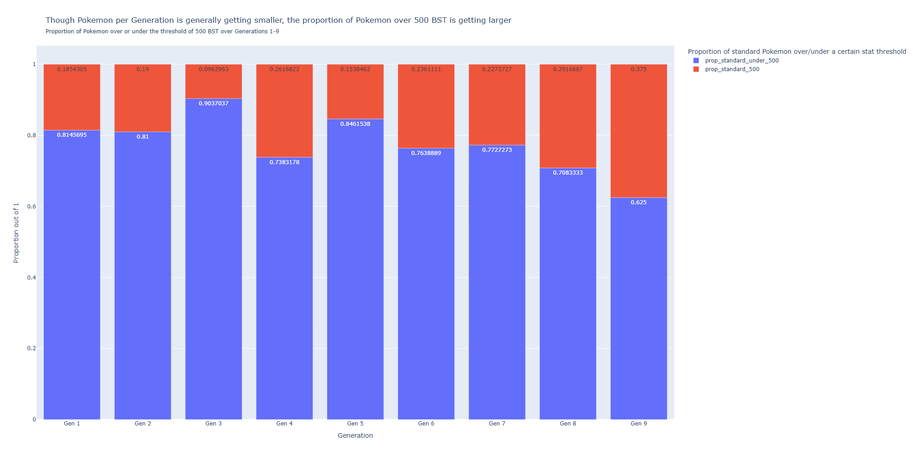

# Is it worth it to catch them all? Pokemon and power creep
**An ME204 final project**

## The question

Has Pokemon experienced power creep over its 30 years of existence? If so, to what extent has power creep been experienced?

### Why does this question matter?

Power creep is defined as "the strengthening of [a] game and its pieces over time possibly to the point where new pieces invalidate older ones" [(Magruder, 2022)](https://journals.sagepub.com/doi/full/10.1177/15554120211050812#bibr20-15554120211050812). This occurs because designers of games want to keep them fun and exciting, because fun and exciting translates to increased revenue [(Magic the Gathering on new cards released, 2020)](https://magic.wizards.com/en/news/card-preview/fire-it-2019-06-21). However, too much power creep can leave a game unrecognizeable. One such example of this is Yu-Gi-Oh. Perform one search with the key word 'power creep yugioh' on Reddit and loads of posts from both Yu-Gi-Oh and non-Yu-Gi-Oh related subreddits will come up. Some of these posts were made as recently as two months ago, others as far back as five years.

 With new cards coming into the meta all the time, players can potentially feel the need to keep purchasing new cards if they want to keep up, which may lead to their exit from the game [(Reddit thread making such a claim)](https://www.reddit.com/r/yugioh/comments/1k9zzvg/power_creep/).

Pokemon as a franchise has demonstrated a great deal of longevity thus far, and with parents sharing their love of Pokemon with their kids, it seems as though this longevity won't fade for a long time [(Amenabar, 2022)](https://www.washingtonpost.com/video-games/2022/08/10/pokemon-starter-parents-kids/). But, if power creep is too high, this claim may not come true.

In essence, by measuring power creep, we may be able to predict how long a franchise will last.

### How are you going to measure power creep?

Pokemon is a complex, ever-growing game. With each new Generation we get new abilities, new moves, updates to existing mechanics, brand-new gimmicks, tweaks to the Pokemon themselves, etc. etc. With so many moving parts, there are many different avenues through which to measure power creep.

I am going to measure power creep through base stat totals (BSTs), which is a measure of a Pokemon's raw potential. 

In game, a Pokemon's stats are affected by many different factors, and stats are not the only thing, or even the main thing, that matters when determining the outcome of a Pokemon battle. For instance, Slaking, a Pokemon with a BST of 670, has the terrible ability Truant, making it so that it can only move every two turns. In theory, however, the higher a Pokemon's stats are, the more powerful they are, so it serves as a good baseline measure of the overall power level in Pokemon. Additionally, since BSTs are represented by numbers, they make for easy, clear-cut comparisons. A larger number means a Pokemon is more powerful, at least stats-wise.

### What's the baseline you're going to compare power creep to?

All BSTs are going to be compared to Generation 1 BSTs. If Pokemon has not experienced power creep, then BSTs in Generation 9 should be about the same as in Generation 1. Of course, BSTs won't be exactly the same between Generation to Generation, but if there is a noticeable difference between later Generations and Generation 1, then there is evidence of power creep.

### But there are lots of different Pokemon, with lots of different forms! Is every Pokemon going to be included in your analysis?

Not every Pokemon and Pokemon form is going to be included in this analysis. Some of this is for the best: there might be many different forms of Cosplay Pikachu in Omega Ruby/Alpha Sapphire, but these are not new Pokemon, nor do they affect Pikachu's BST. However, with the way my filter works, some of the Pokemon included does hinder my analysis: Normal Form Terapagos is the form used in the analysis, yet it cannot be used in a meaningful way in game (it will always transform into its Terastal Form at the start of every battle) and has significantly worse base stats.

Overall, here are the Pokemon that were filtered out of the dataset:
- All Megas and Gigantimaxes, since they are more 'gimmicks' confined to a Generation rather than actual new Pokemon
- If a Pokemon has alternate forms, then only one of those forms is included (ex: Wormadam has three forms but only Wormadam Plant Cloak is included). This includes regional variants of Pokemon (ex: no Alolan Ratatta) and Pokemon that use a Held Item to transform into a different form (ex: Zacian becomes Zacian Crowned, but Zacian Crowned is not included)
- Pokemon who are fusions of two or more Pokemon (ex: Kyurem White, Kyurem Black, Calyrex Shadow Rider, Calyrex Ice Rider). These Pokemon will only have their unfused forms counted (ex: Kyurem and Reshiram for Kyurem White)
- Pokemon with purely visual differences (ex: Vivillon)

### What about sub-categories of Pokemon, like the Ultra Beasts or Paradox Pokemon? How are they going to be treated?

This analysis uses three overall classifications of Pokemon: Standard, Legendary, and Mythical, which are classifications given by The Pokemon Company to the Pokemon themselves. Sub-categories, like Ultra Beasts and Paradox Pokemon, are grouped in with Standard Pokemon because they are one-off classes added for specific Generations and not classes that get new additions with every Generation. Since I want to do an over-time Generation comparison, it is better to group them in with Standard Pokemon. Baby Pokemon, though they are also given their own label by The Pokemon Company, are included under Standard Pokemon for the same reason.

I believe it makes sense to group these sub-categories in with Standard Pokemon as it makes a good measure of power creep: The Pokemon Company are introducing these powerful new classes of Pokemon for one Generation and then dropping them in the next, thereby artificially inflating the power level of that given Generation. This is not to say that The Pokemon Company is 'wrong' for doing this with their games; it is just to say that it makes for a good measure of power creep.

### Some Pokemon have had their stats changed between Generations. How are you going to deal with that?

All Pokemon, regardless of whether they have had their stats changed between Generations or not, are going to have their current base stats used. Though this will potentially skew the data, most often, when Pokemon have their stats changed, they're only changed in one category by 10 points. As such, I do not believe the data will be heavily skewed.

## The findings

### Overall, Standard Pokemon have been getting stronger with each Generation

Standard Pokemon after Generation 4 have higher BSTs than their earlier Generation counterparts. Generation 1 sits at around a 400 BST average; since Generation 4, Pokemon have been above that average. Generation 9, the most recent Generation, has the highest average BST at around 440. It has not been a consistent increase across all generations, however; Generations 2 and 3 had a lower average BST than Generation 1, and after a peak in Generation 4, BSTs in Generations 5 and 6 decreased again. Still, over time, there is a general upward trend, and after Generation 4, average BSTs stay higher than the Generation 1 average.

Legendaries and Mythicals, on the other hand, tell a different story. Legendaries and Mythicals have been consistently stronger than Standard Pokemon for each Generation, and this remains true even when their power level takes a dip in Generation 7 (likely due to Cosmog and Cosmoem having lower BSTs by virtue of being earlier in an evolution line). Mythicals bounce back in power level quickly in Generations 8 and 9, while Legendaries stay lowered in average BSTs . This is ikely because base Zacian and Zamazenta are used rather than their Crowned versions for Generation 8, and Terapagos's Normal Form, rather than its Terastal Form. Still, Legendaries and Mythicals tend hover around the 600 BST mark, Mythicals adhering to that benchmark more strictly than Legendaries. 

The most important finding from the Legendary and Mythical lines on the graph is that they are a stronger class than Standard Pokemon, which is relevant for my next finding.

### Legendaries and Mythicals have been getting more common with each Generation, even as less Pokemon are added overall

The Generation that had the most Pokemon added to it was Generation 5, at 156. After Generation 5, and with the exception of Generation 9, less than 100 Pokemon have been added with each Generation, and even Generation 9's number of Pokemon does not reach the heights of Generations 1 and 5. The low addition numbers in Generations 7 and 8 can be partially explained with the exclusion of regional variants from this analysis, but not Generation 6.

Despite less Pokemon being added, generally, in newer Generations, more and more of the new Pokemon added are Legendary and Mythical Pokemon. The proportion does not increase cleanly over the Generations, much like the increase of average BSTs over each Generation, but it is still noticeably higher in later Generations than in Generation 1. 

The proportion of Legendaries has increased noticeably, reaching its peak in Generation 7 with 1/8th of the newly-introduced Pokemon being Legendaries. The proportion of Mythicals has returned to around Generation 1 levels in Generations 8 and 9, but Generations 3 through 7 have had increased proportions of Mythicals compared to Generation 1.

Legendaries and Mythicals are in a power class of their own. If these two types of Pokemon are becoming more and more common with each Generation, especially with less added Pokemon overall, then there is less incentive to use the new Standard Pokemon. Why use a weaker Pokemon when super powerful Legendaries and Mythicals are more common and available for use? A decrease in rarity of these special classes of Pokemon is an indicator that power creep has occurred in Pokemon.

### There is a higher proportion of Standard Pokemon over 500 BST in newer Generations than in older Generations, even as less Pokemon are added overall

As mentioned earlier, less Pokemon, generally, are being added in new Generations. However, much like Legendaries and Mythicals, Pokemon over 500 BST are becoming more and more common after Generation 5, reaching its peak in the latest Generation where over 1/3 of Standard Pokemon have a BST over 500.

500 BST has been chosen as a notable threshold for a couple of reasons. For one, it is around halfway between the Generation 1 average BST and the 600 BST mark that Legendaries and Mythicals reach. If Generation 1 is our benchmark to compare everything else to, then we should use Generation 1 metrics to derive a threshold from. Additionally, after some research, you start to get into the upper-BST tiers of each type of Pokemon (excluding Legendaries and Mythicals) after the 500 BST mark [(Pokemon Database Forum)](https://pokemondb.net/pokebase/355610/what-pokemon-have-the-best-stat-totals-of-each-type). Therefore, 500 BST is a good threshold for what constitutes a more powerful Pokemon. 

For similar reasons as stated above, with more powerful Pokemon being added more frequently in recent Generations, older, weaker Pokemon are being disincentivized from use in favor of these newer, stronger Pokemon. And, with less Pokemon being added in newer Generations, more powerful Pokemon being added means that less weaker Pokemon are being added, which is leading to the increased average BST of later Generations. Without power creep, the proportion of Pokemon over 500 BST would have stayed relatively the same as Generation 1 over every Generation. But, considering over 1/3 of Generation 9's Pokemon are over 500 BST compared to Generation 1's under 1/5, that is not the case. An increase in Pokemon over the 500 BST threshold is an indicator that power creep has occurred in Pokemon.

## Limitations of the analysis

As stated earlier, not all forms of Pokemon were included in this analysis. I feel the most detrimental exclusions from this list are the regional variants, especially for Generations 7 and 8. This would increase the amount of Pokemon added in those Generations and may change the proportions found in the above graphs, as well as their overall average BST. A future analysis with stricter filtering criteria could be performed in the future to remedy this. Additionally, not all forms of all Legendaries were included in this list, including some Legendaries with extremely high BSTs. Adding these to the analysis might drastically change the picture of how Legendary Pokemon have evolved over each Generation, and might also change the proportions of Legendaries vs. Mythicals vs. Standard Pokemon added in each Generation.

Not all of the BSTs used in this analysis reflect the BSTs of the Pokemon at the time they were added in their Generations, as stated earlier. This has the potential to introduce some skew in the data and might actually make the effects of power creep shown in the graphs above more pronounced, as often Pokemon have their stats added to rather than taken away from. Not using historical BSTs might affect the conclusions that can be drawn from these analyses.

Finally, any claims I can make from my analyses about power creep in Pokemon can only be applied to how BSTs have changed over each Generation. I cannot draw any conclusions about the state of power creep in the other multitudes of mechanics present in Pokemon, or even in the gimmicks that have been introduced in the newer Generations, from Megas in Generation 6 to Terastallization in Generation 9. To get a full picture of power creep in Pokemon, more analyses will have to be conducted in the future.

## Conclusion

The evidence that Pokemon has experienced power creep, at least in terms of BSTs, exists, but it does not indicate overwhelming power creep. Over time, the BSTs of Standard Pokemon have been increasing, and the proportion of Pokemon added in each Generation over 500 BST has been increasing, as well, even though Pokemon added is less in later Generations. And, though Legendaries and Mythicals have not been increasing in power level over each Generation like Standard Pokemon have been, there have been more and more Legendary and Mythical Pokemon added each Generation, even though there are less Pokemon added in later Generations, as stated before. Of course, this conclusion that power creep does exist only applies to the BSTs of the Pokemon themselves and not to the series as a whole. Power creep is something almost all long-running series need to be wary of, and Pokemon is no exception.

