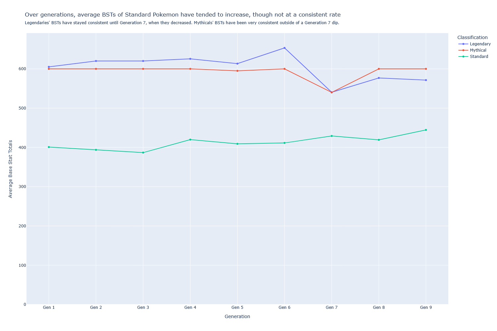
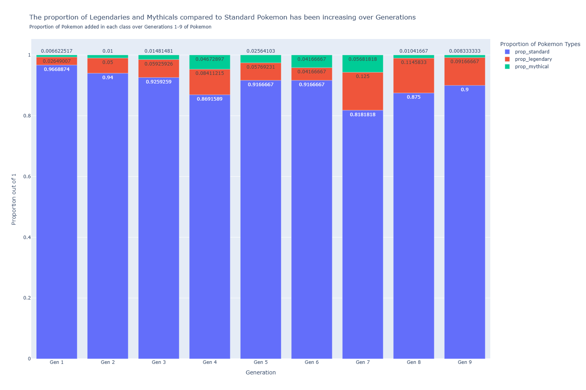

# Is it worth it to catch them all? Pokemon and power creep
**An ME204 final project**

[use just and index.md if working solo, but if working with others, add links to their invidiual pages like below]

- [AEG-1309](./AEG-1309.md)

## The question

Has Pokemon experienced power creep over its 30 years of existence? If so, to what extent has power creep been experienced?

### Why does this question matter?

Power creep is defined as "the strengthening of [a] game and its pieces over time possibly to the point where new pieces invalidate older ones" (citation). This occurs because designers of games want to keep them fun and exciting, because fun and exciting translates to more revenue (citation). However, too much power creep can leave a game unrecognizeable. One major example is Yu-Gi-Oh. Perform one search with the key word 'power creep yugioh' on Reddit and loads of posts from both Yu-Gi-Oh and non-Yu-Gi-Oh related subreddits will come up, some as recently as two months ago, but others as far back as five years ago (citation). With new cards coming into the meta all the time, players can potentially feel the need to keep purchasing new cards if they want to keep up, which may lead to their exit from the game (citation). 

Pokemon has experienced a lot of longevity as a franchise thus far, and with parents sharing their love of Pokemon with their kids, it seems as though it will continue far into the future (citation). But, if power creep is too high, that longevity may start to fade.

### How are you going to measure power creep?

Pokemon is a complex, ever-growing game. With each new generation we get new abilities, new moves, updates to existing mechanics, brand-new gimmicks, tweaks to the Pokemon themselves, etc. etc. With so many moving parts, there are many different avenues through which to measure power creep. The avenue I am going to be choosing, however, is base stat totals (BSTs), which is a measure of the raw potential of a Pokemon's power. In game, a Pokemon's stats are affected by many different factors, which make it hard to measure the pure effect of base stats. In theory, however, the higher a Pokemon's stats are, the more powerful they are, so it is a good baseline measure of the overall power level in Pokemon.

Additionally, since BSTs are represented by numbers, they make for easy comparisons. A larger number means a Pokemon is more powerful stats-wise; there's little room for interpretation.

### What's the baseline you're going to compare power creep to?

All future Generations' BST is going to be compared to Generation 1 BST. If power creep has not occurred, then BSTs in Generation 9 should be about the same as in Generation 1. It doesn't need to be exactly the same; there will be minor fluctuations in BST across the generations with different Pokemon makeup. However, if there is a noticeable difference between later generations in Generation 1, then there is evidence that power creep has occurred.

### But there are lots of different Pokemon, with lots of different forms! Are they going to be included in your analysis?

Not every Pokemon and Pokemon form is going to be included in this analysis. Some of this is for the best: all of the different costumes for Cosplay Pikachu in Omega Ruby/Alpha Sapphire, for example, might affect how that Pokemon does in the contests and what moves it can learn, but it does not count as a 'new' Pokemon nor are its base stats affected. It is similar to a Mega evolution in that it was introduced purely for a gimmick and is tied to one Generation. However, it would do some forms better to be included in this analysis: Normal Form Terapagos is the form of choice for this analysis, yet it cannot be used in a meaningful way in game (it will always transform into its Terastal Form at the start of every battle) and has significantly worse base stats. Excluding Cosmoem (the first in the Solgaleo/Lunala evolution line) from the analysis of Legendary Pokemon would have been beneficial for the same reason.

In this analysis:
- There are no Megas or Gigantimaxes included, since they are more 'gimmicks' confined to a Generation rather than actual new Pokemon
- If a Pokemon has alternate forms, then only one of those forms will be used (ex: Wormadam has three forms but only one of them will be used in the analysis). This includes regional variants of Pokemon (only the regional form that the Pokemon was introduced in will be used)  and Pokemon that use a Held Item to transform into a different form (ex: Zacian becomes Zacian Crowned, but Zacian Crowned is not included)
- Pokemon who are fusions of two or more Pokemon (ex: Kyurem White, Kyurem Black, Calyrex Shadow Rider, Calyrex ) will only have their unfused forms counted (Kyurem and Reshiram for Kyurem White, for example), not the whole fusion
- Pokemon with purely visual differences (ex: Vivillon) are automatically excluded

### What about sub-categories of Pokemon, like the Ultra Beasts or Paradox Pokemon? How are they going to be treated?

This analysis uses three overall classifications of Pokemon: Standard, Legendary, and Mythical, which are classifications given by The Pokemon Company to the Pokemon themselves. Sub-categories like Ultra Beasts and Paradox Pokemon are grouped in with Standard Pokemon as they were not given any special label by The Pokemon Company to differentiate themselves otherwise.

I believe it makes sense to group these sub-categories in with Standard Pokemon as it makes a good measure of power creep: The Pokemon Company are introducing these powerful new classes of Pokemon and then dropping them in the next Generation, thereby essentially artificially inflating the power level of a given Generation. This is not to say that The Pokemon Company is 'wrong' for doing this with their games; it is just to say that I consider it a measure of power creep. 

## The findings

### Overall, Standard Pokemon have been getting stronger with each generation

Standard Pokemon, mostly after Generation 4, have higher BSTs than their earlier Generation counterparts. Generation 1 sits at around a 400 BST average; since Generation 4, Pokemon have been above that average with Generation 9 coming in at around 440 BST. It has not been a consistent increase across all generations, however; Generations 2 and 3 had a lower average BST than Generation 1, and after a peak in Generation 4, Generations 5 and 6 decreased again, but they never quite returned to the level of Generation 1. Still, over time, there is a general upward trend.

Legendaries and Mythicals, on the other hand, tell a different story. Legendaries and Mythicals have been consistently stronger than Standard Pokemon for each Generation, and this remains true even when their power level takes a dip at Generation 7 (likely due to Cosmoem and Cosmog having lower BSTs by virtue of being earlier in an evolution line, at least for Legendaries). Mythicals bounce back in power level quickly in Generations 8 and 9, while Legendaries stay lowered (likely because base Zacian and Zamazenta are used rather than their Crowned versions for Generation 8, and the variation of Terapagos of choice is its Normal Form for Generation 9). Still, Generally, Legendaries and Mythicals hover around the 600 BST mark, Mythicals adhering to that benchmark more strictly than Legendaries.

### Legendaries and Mythicals have been getting more common with each generation

The Generation that had the most Pokemon added to it was Generation 5, at 156. After Generation 5, and with the exception of Generation 9, less than 100 Pokemon have been added with each Generation, and even when over 100 Pokemon are added in a Generation, it doesn't quite reach the height of Generations 1 and 5. Somne of the new Pokemon added in Generations 7 and 8 were regional variants, which were not included in this analysis, which can partially explain the low addition numbers. 

Despite less Pokemon being added, generally, in newer Generations, more and more of the new Pokemon added are Legendary and Mythical Pokemon. The proportion does not increase cleanly over the Generations, much like the increase of average BST over each Generation, but it is still noticeably higher in later Generations than it was in Generation 1. The proportion of Legendaries has increased noticeably, reaching its peak in Generation 7 with 1/8th of the introduced Pokemon being Legendaries. The proportion of Mythicals has returned to around Generation 1 levels in Generations 8 and 9, but Generations 3 through 7 have had increased proportions of Mythicals compared to Generation 1.

Legendaries and Mythicals are in a power class of their own. If these two types of Pokemon are becoming more and more common with each Generation, especially if less Pokemon overall are being added with each Generation, then there is less incentive to use the new Standard Pokemon if there are all these powerful Legendaries and Mythicals available for use. A decrease in rarity of these special classes of Pokemon is one indicator that power creep has occurred in Pokemon.

### There is a higher proportion of Standard Pokemon over 500 BST in newer Generations than in older Generations

As mentioned earlier, less Pokemon, generally, are being added in new Generations. However, much like Legendaries and Mythicals, Pokemon over 500 BST are becoming more and more common after Generation 5, reaching its peak in the latest Generation where over 1/3 of Standard Pokemon have a BST over 500.

500 BST has been chosen as a threshold for a multitude of reasons. For one, it is around halfway between the Generation 1 average BST and the 600 BST threshold often used for Mythicals and Legendaries. If Generation 1 is our benchmark to compare everything else to, then it makes sense to derive a 'Powerful Pokemon' threshold from Generation 1. Additionally, after some research, you start to get into the upper-BST tiers of each type of Pokemon (excluding Legendaries and Mythicals) after the 500 BST mark (source). Therefore, 500 BST is a good threshold for what constitutes a more powerful Standard Pokemon. 

For similar reasons as stated above, with more powerful Pokemon being added more frequently in more recent Generations, older, weaker Pokemon are being disincentivized from use in favor of these newer Pokemon. And, with less Pokemon being added in newer Generations, more powerful Pokemon means that less weaker Pokemon are being added, which is pumping up the overall average BST of each Generation (as seen in the graph above.) If there was no power creep, then the proportion of Pokemon over 500 BST would have stayed relatively the same as Generation 1 as in Generation 9. But, considering over 1/3 of Generation 9's Pokemon are over 500 BST compared to Generation 1's under 1/5, that is not the case. This is evidence that Pokemon has experienced some power creep over time.

## Limitations

As stated earlier, not all forms of Pokemon were included in this analysis. The most detrimental exclusions from this list, I feel, are the regional variants of Pokemon being excluded from later Generations, especially 7 and 8. This would increase the amount of Pokemon added in those Generations and may change the proportions found in the above graphs.

Additionally, weaker variants of some Legendaries were used in the analysis, and not all forms were included. Adding these to the analysis might drastically change the picture of how Legendary BSTs have evolved over each Generation, and might also change the proportions of Legendaries vs. Mythicals vs. Standard Pokemon added in each Generation.

Finally, any claims I can make from my data about power creep in Pokemon can only be applied to how BSTs have changed over each Generation. There is no evidence of power creep in any of the other multitudes of mechanics present in Pokemon, or even in the gimmicks that have been introduced in the newer Generations, from Megas in Generation 6 to Terastallization in Generation 9. This analysis is only one part of the picture that is power creep in Pokemon.

## Conclusion

The evidence that Pokemon has experienced power creep, at least in terms of BSTs, is not overwhelming, but it does exist. Over time, the BSTs of Standard Pokemon have been increasing, and the proportion of Pokemon added in each Generation over 500 BST has been increasing, as well. And, though Legendaries and Mythicals have not been increasing in power level over each Generation like Standard Pokemon have been, there have been more and more Legendary and Mythical Pokemon added each Generation, even though the overall amount of Pokemon added in each Generation is lower in later Generations than in earlier Generations, taking up space where Pokemon with less BSTs could be. Power creep is something almost all long-running series need to be wary of, and Pokemon is no exception.

